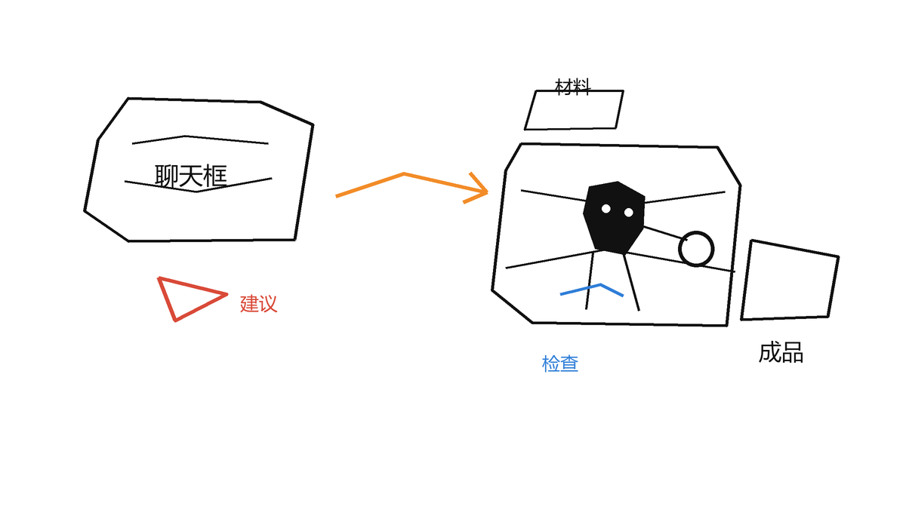
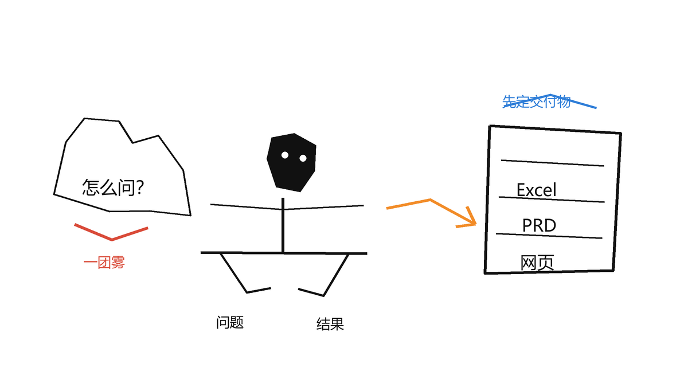
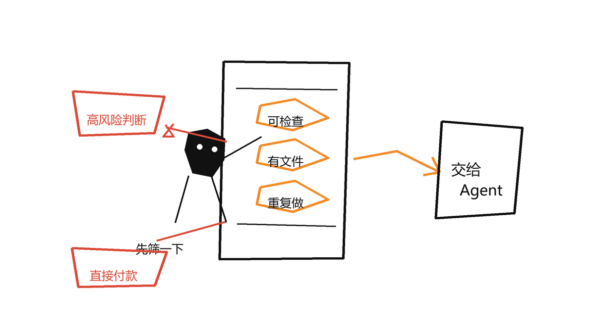
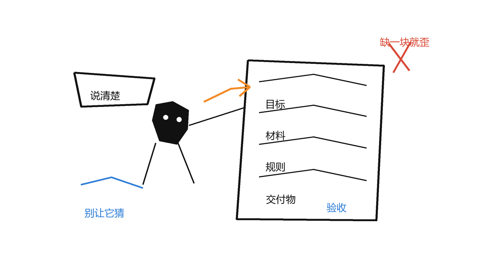
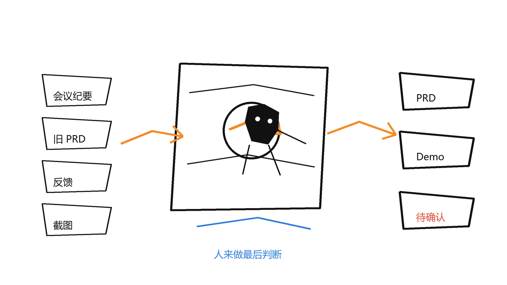
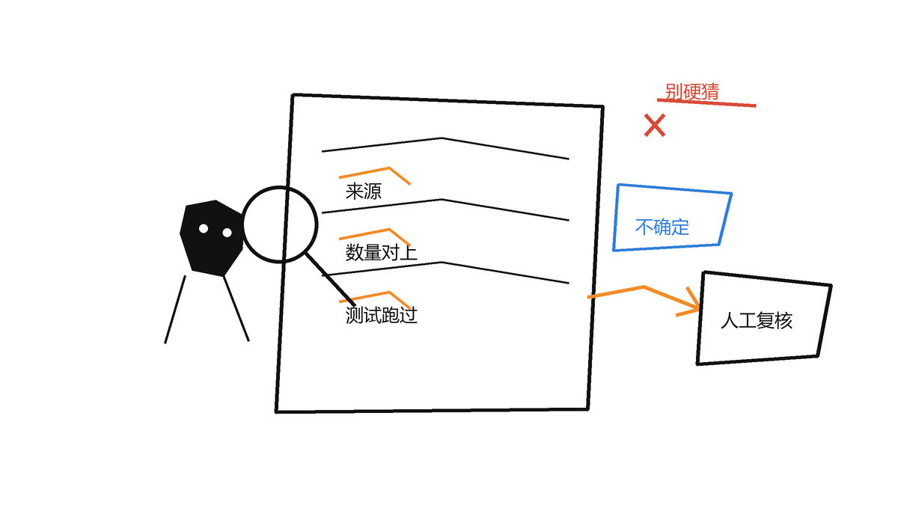

这两年，AI 工具多到有点烦人。模型一天比一天强，产品发布会也一场接一场。可真放到日常工作里，很多人的用法其实没怎么变。

有人已经能让 AI 帮他读资料、改文件、做表格、写程序、跑测试。一两个小时过去，原来半天的活已经有了成品。也有人还是打开网页，问一句，复制一段答案，再问一句。回答不太对，就觉得 AI 不靠谱。

我很能理解后一种情况。

我本职是产品经理。做 C 端也好，做 B 端也好，用户都希望产品打开就能用，最好别先塞给他一堆概念。可现在很多 AI 产品还没到这个程度。网上又总有人演示“一句话完成某某工作”，看起来像是只要背出那句提示词，AI 就会立刻懂你的公司、业务、历史包袱和个人习惯。

真用起来，当然不是这样。

这篇文章不整理一百条提示词，也不劝你上来就买最贵的模型。我想讲一件更基础的事：怎么把 AI 从“回答问题的聊天框”，慢慢用成“能接手一段工作的 Agent”。

你不用先学编程，也不用第一天就研究 MCP、API、Skill 这些词。先找一个真实任务，把材料准备好，要求 AI 直接交付文件，然后学会检查它。做到这一步，你就已经不是在一问一答了。



## 一、聊天框和 Agent，到底差在哪

普通聊天很简单：你输入一段话，AI 回你一段话。

比如你说：“帮我写一份产品需求文档。”它通常会给你一份格式挺像样的 PRD。问题是，它不知道你们产品现在长什么样，不知道上次评审为什么否了某个方案，也不知道团队一直用哪套模板。它只能按最常见的样子猜。

Agent 多做了几步。

它会先去找完成任务需要的材料，读文件、网页、代码或其他你授权的信息。然后它会选择工具，新建文件、修改文件、运行检查。出错了，它还可以继续改。最后交给你的，不只是一个回答，而是能继续用的成果，以及它检查过什么。

还是刚才那份 PRD。如果你用的是 Codex 这类 Agent 工具，可以让它读取项目文件夹里的历史 PRD、会议纪要、用户反馈和原型说明，然后在同一个文件夹里生成新版文档。你还可以让它核对新需求有没有和旧规则冲突，异常情况有没有漏。

聊天框给你的通常是一段建议。复制、整理、保存、改格式、检查，还是你自己来。Agent 接到的是一项任务，它能在你允许的范围里把事情往前推一截。

所以我现在判断自己有没有真的把 AI 用进工作，会先问一个很土的问题：

> 这次 AI 只是告诉我该怎么做，还是已经替我做掉了一部分？

## 二、先别急着研究提示词，先想最后要拿到什么

很多人用 AI 时，脑子里想的是“我该怎么问”。我现在更关心另一个问题：最后我想拿到什么东西？

人做完工作，总会留下结果。一份 Excel，一版 PPT，一个整理好的文件夹，一封待发送的邮件，一份测试报告，或者一个能打开的网页。既然结果本来就在电脑里，那就尽量让 Agent 直接生成结果，而不是只在对话框里讲做法。

下面这两种问法，看着差一点，效果差很多。

### 只问一句

> 帮我总结这份会议纪要。

### 把它当成一项任务

> 读取“会议纪要”文件夹里的最新会议记录，整理本次会议的结论、未决问题、负责人和截止时间。在当前目录新建《7月25日项目会议行动清单.md》，不要修改原始纪要。完成后检查每一项行动是否能在原文中找到依据，无法确认的内容标记为“待确认”。

再看一个例子。

### 只要一段内容

> 帮我做一份竞品分析。

### 要一个后面还能继续用的成果

> 阅读“竞品资料”文件夹里的 8 份产品介绍，按照价格、目标用户、核心功能、部署方式和已知限制进行比较。把结果写入《竞品对比.xlsx》，每个结论保留来源文件名。再根据表格生成一页《竞品结论.md》，只总结有材料支持的差异。

第二种写法没有什么玄学。它只是把几件事说清楚了：资料在哪，要做什么，结果放哪，怎样才算做完。



## 三、哪些活适合先交给 Agent

理论上，很多能在电脑上做的事都能让 AI 参与。但“能做”和“值得交给它做”不是一回事。

刚开始我会选这种任务：

- 材料已经是电子文件，比如 Word、Excel、PDF、Markdown、图片或网页。
- 流程重复，每周或每月都会做。
- 输出格式比较固定。
- 结果容易检查，做错了也能重来。
- 人手工做至少要半小时，不是点两下鼠标就结束的小事。

比较适合练手的任务有这些：

- 把多份会议纪要整理成行动清单。
- 从一批文档里提取固定字段，生成表格。
- 根据现有模板生成周报、测试报告或需求文档初稿。
- 对照两个版本的文件，找出增删改内容。
- 把一篇文章整理成公众号发布包，包括标题、引言、配图需求和排版稿。
- 在已有项目里改一个小功能，并跑一遍现有测试。

下面这些就要慢一点：

- 需要替你做录用、辞退、放款、医疗之类的高风险判断。
- 会直接付款、下单、删除数据或向外部发送信息。
- 材料里有敏感信息，但你还没确认工具怎么处理数据。
- 任务目标太模糊，连你自己也说不清满意结果是什么。
- 结果没法核对，只能因为“看起来像”就相信它。

有些流程人点两下只要十秒，交给 Agent 反而要解释三分钟。这种先别自动化。提效不是把所有事情都扔给 AI，而是先找那些耗时、重复、规则说得清的环节。



## 四、给 Agent 派活，至少把五件事讲明白

我现在给 Agent 布置任务，会尽量补齐五类信息：目标、材料、规则、交付物和验收方式。

### 目标：这次到底要解决什么问题

别只说“分析一下”或“优化一下”。这两个词太宽了。

可以这样说：

> 我需要在明天下午的评审会上说明用户为什么频繁放弃注册。请根据现有反馈，找出高频原因，并区分产品问题、运营问题和暂时无法判断的问题。

Agent 知道结果要用在评审会上，才会明白哪些信息该优先保留，哪些只是背景。

### 材料：它应该相信哪些信息

告诉它从哪里读资料。比如：

- 当前项目中的 `用户反馈` 文件夹。
- 最近三个月的客服记录表。
- 公司统一的 PRD 模板。
- 你指定的网页或已经连接的知识库。
- 当前代码库和里面的说明文件。

如果材料之间有优先级，也要写出来。例如“最新版本的产品说明优先于旧会议纪要”“数据表和文字描述冲突时先标记，不要自己猜”。

资料不完整时，最好允许 Agent 明确说“不知道”。你逼它必须给出唯一答案，幻觉通常就是从这里开始的。

### 规则：哪些能做，哪些不能碰

规则不用写成合同，但边界要有。

例如：

- 不修改原始文件，只在 `输出` 文件夹中新建结果。
- 不补写材料中没有出现的数据。
- 涉及个人信息时，只保留岗位评估所需字段。
- 发现冲突先列出来，不要擅自选一个版本。
- 需要安装软件、发送邮件或覆盖文件前，先征求确认。

这些约束不是为了“管住 AI”，而是为了让你事后能判断哪里出了问题。

### 交付物：最后要落到哪个文件里

尽量写清文件名、格式和保存位置。

比如：

> 最终在当前目录生成两个文件：`候选人初筛.xlsx` 和 `初筛说明.md`。表格用于后续筛选，说明文件记录筛选规则、资料缺失项和需要人工复核的情况。

当你只说“给我看看结果”，Agent 很容易退回聊天模式。明确要求文件，它才更像在干活。

### 验收：怎么知道它做完了

这一步最容易被省掉。

验收标准可以很普通：

- 输出文件能正常打开。
- 每一份输入材料都有处理记录，没有漏文件。
- 表格列名和公司模板一致。
- 关键结论保留来源。
- 无法确定的内容进入“人工复核”清单。
- 修改代码后，相关测试必须通过。

最好让 Agent 先自查一遍，再告诉你“做了什么、检查了什么、还有什么不能确认”。AI 会错，但没有验收标准时，你连它错在哪里都不容易发现。

这份模板可以直接改：

```Plain
任务目标：
我要用这份结果做什么？这次要解决什么问题？

可用材料：
请读取哪些文件、文件夹、网页或系统信息？
哪些材料优先？遇到冲突怎么处理？

执行要求：
必须遵守哪些规则？
哪些内容不能修改、不能猜测、不能对外发送？

交付结果：
请生成什么文件？使用什么格式？保存到哪里？

验收标准：
怎样判断结果完整、准确、可以继续使用？
哪些情况必须交给我人工确认？

执行方式：
先检查现有材料是否足够。如果缺少会影响结果的关键信息，先说明。
材料足够时直接执行。完成后自查，并汇报生成的文件和未解决问题。
```



## 五、一个完整例子：从会议纪要到 PRD 和 Demo

假设我刚开完一次产品讨论会。手里有会议纪要、旧版 PRD、用户反馈和现有产品截图。我想把会上讨论的新点子整理成需求，再做一个简单 Demo，第二天拿给团队看。

如果只用聊天框，我大概会反复复制材料。先让 AI 总结，再让它写 PRD，再把内容搬到文档里。做 Demo 时还要重新解释背景。每换一个对话，上下文就丢一块。

用 Agent 时，可以先把材料放进一个独立文件夹：

```Plain
新功能讨论/
├─ 01-会议纪要.md
├─ 02-旧版PRD.md
├─ 03-用户反馈.xlsx
├─ 04-现有页面截图/
└─ 输出/
```

然后给它一项完整任务：

```Plain
请先阅读当前文件夹中的会议纪要、旧版 PRD、用户反馈和页面截图。

目标是把会议中提出的“批量编辑”想法整理成一份可以参加内部评审的需求方案，并制作一个可在电脑上打开的交互 Demo。

要求：
1. 先确认会议纪要中的明确结论、未决问题和假设，不要把讨论中的随口建议写成已确定需求。
2. 新需求不能与旧版 PRD 中已经上线的规则冲突。发现冲突时单独列出。
3. PRD 至少包含使用场景、用户流程、功能规则、异常情况、权限限制、数据记录和验收条件。
4. Demo 只验证核心流程，不需要登录、支付或真实后端。
5. 不修改原始材料，所有结果写入“输出”文件夹。

交付：
1. 输出/批量编辑-需求文档.md
2. 输出/demo/ 中可直接打开的 Demo
3. 输出/待确认问题.md

完成后检查 Demo 能否正常打开，逐项核对 PRD 的验收条件，并说明哪些结论来自哪份材料。
```

接下来，Agent 会读材料、整理规则、生成文件、运行 Demo。遇到报错，它会尝试继续修。你不需要守着它每一步，但有几个地方必须介入：

- 旧资料互相冲突时，由你决定采用哪个版本。
- 它准备安装新依赖或大范围改文件时，由你确认风险。
- 初稿完成后，你重点看业务判断，不只是看排版顺不顺眼。
- 团队正式使用前，还是要走评审和测试。

这个例子里，人没有退出工作。人只是从复制、搬运、整理，转到了定目标、补背景、处理冲突和做最后判断。对产品经理来说，这部分时间通常更值得留给自己。



## 六、不写代码的人，也能用 Agent 做什么

Codex 最早给人的印象是写代码，但 Agent 处理的不是“代码”本身，而是文件、资料和工具。只要你的工作有输入和输出，就有机会用上。

### 例子一：从一批业务文件中提取信息

假设运营同事每周都要看几十份业务单据，再把客户名称、单号、日期、金额和异常项录入 Excel。

可以先准备：

- 一份脱敏后的样例文件。
- 一份最终表格模板。
- 每个字段的提取规则。
- 几个容易混淆的反例。

然后要求 Agent 读取指定文件夹，逐份提取信息，写入模板，并额外生成“待人工复核.xlsx”。验收时先看输入文件数和处理记录数是否一致，再抽查高风险字段。

这里别指望 AI “聪明地理解一切”。字段边界、冲突优先级、无法判断时怎么办，都应该由人提前定。拿不准的记录宁可进人工复核，也别为了让表格好看去猜一个值。

### 例子二：HR 整理简历

假设 HR 收到一批岗位简历，可以让 Agent 按统一维度整理学历、工作年限、相关项目和资料缺失项，再生成候选人对比表。

但我不建议让它直接决定“录用谁”或自动淘汰谁。招聘判断涉及偏见、隐私和真实岗位需求，AI 更适合做信息整理和初步匹配。最后的判断，应该留给招聘人员。

一条更稳的任务可以这样写：

```Plain
读取“待整理简历”文件夹中的文件，按照“岗位要求.md”提取与岗位直接相关的信息，写入“候选人信息表.xlsx”。

不得推测年龄、婚育、性格、健康状况等简历中没有明确提供的信息，也不要依据照片、姓名或籍贯进行评价。资料不足时写“未提供”。

请单独列出满足哪些明确条件、缺少哪些信息，不要给出录用或淘汰结论。每条信息保留来源简历文件名。完成后核对文件总数。
```

### 例子三：把文章整理成发布版本

假设你已经写好一篇公众号文章。过去还要自己取标题、写引言、安排配图、检查 Markdown，再复制到排版工具。

现在可以让 Agent 读取原稿和过往文章，保留作者口吻，在新文件夹里生成：

- 不改动事实的润色版文章。
- 三到五个标题备选。
- 一段 100 字以内的引言。
- 配图位置和画面说明。
- 最终发布检查清单。

如果它连接了图片生成或排版工具，还可以继续生成图片和预览稿。能不能直接做到这一步，取决于你用的 Agent 有没有对应工具和权限。只对它说“去访问我的公众号后台”，它不会凭空拿到访问能力。

## 七、工具、权限、MCP 和 Skill，先按日常东西理解

很多教程一开始就把名词摊开，普通用户很容易在这里放弃。我的建议是先别纠结实现，按日常工作来理解。

### 工具：Agent 的手脚

模型负责理解和判断，工具负责做动作。比如读取文件、搜索内容、运行程序、操作网页、生成图片、写入文档。

没有工具时，AI 只能告诉你“应该怎么做”。有了合适的工具，它才可能自己去做。

### 权限：哪些门能打开

Agent 能看什么、能改什么，不应该无限制。稳妥的做法是只开放当前任务需要的范围。

它只需要整理一个项目，就给它项目文件夹，别顺手开放整个硬盘。只需要读取资料，就先给只读权限。覆盖、删除、发送和付款这类动作，最好要求二次确认。

### MCP 或连接器：接上外部服务

你的资料可能不在本地文件夹，而是在飞书、Notion、网盘、数据库或其他系统里。MCP、连接器和类似机制，可以让 Agent 在授权后读取或操作这些服务。

普通用户不用先研究它们怎么实现。你只要知道：Agent 想去某个系统拿资料，必须先有可用连接，也必须经过授权。支持不支持，要看你正在用的产品。

### Skill：把反复讲的规则写成说明书

如果一项任务每次都要重复讲十几条规则，可以把这些规则整理成 Skill。你可以把它理解成一份 Agent 会按需读取的标准作业说明。

比如公司写 PRD 有固定章节、字段命名和评审要求。第一次可以把规则直接写进任务。连续做了几次，规则稳定了，再把它们沉淀成 Skill。以后只要说“按公司的 PRD 规范处理”，Agent 就能加载那套步骤。

别为了显得专业，第一天就装几十个 Skill。先把一个任务做通，看看哪些要求真的会重复，再沉淀下来。这样留下的规则才有用。

## 八、AI 为什么经常“不靠谱”

AI 确实会犯错。它可能漏读文件，误解表格，补写不存在的事实，也可能生成一个看起来正常但打不开的文件。Agent 能执行更多动作，所以更不能省掉检查。

我不太赞成在“完全相信”和“完全不用”之间二选一。更实际的做法，是把任务设计成容易核对。

### 让结果带来源

做资料总结时，要求关键结论标注来源文件、页码、链接或原文片段。这样你不用重新读完所有材料，也能快速检查重要结论。

### 让数量对得上

处理批量文件时，要求列出总文件数、成功数、失败数和跳过原因。原文件夹里有 53 份材料，结果只出现 51 条，就先找少掉的两份，别急着拿表格去用。

### 让程序真的跑起来

生成网页、脚本或软件时，不要只看代码是否“像那么回事”。让 Agent 实际运行、执行测试，并报告检查结果。有界面的话，最好再打开看一眼：文字有没有重叠，按钮能不能点，页面是不是空白。

### 给不确定性留出口

抽取信息或分类时，保留“无法判断”“存在冲突”“需要人工复核”这类结果。业务规则如果强迫 AI 每次都选一个答案，它在证据不足时也只能硬猜。

### 先小批量验证，再扩大范围

第一次别直接处理几千份正式文件。先拿 10 到 20 份有代表性的样本跑一遍，里面要有正常情况、边界情况和过去容易出错的材料。规则修过以后，再扩大规模。

“AI 不靠谱”有时是模型能力不够，有时是任务没有边界，有时是输入材料不全，也有时只是我们没设置检查环节。把原因拆开，才知道下一步该换模型、补资料，还是重写规则。



## 九、权限和安全，别等出事再补

Agent 能力越强，能碰到的东西越多，权限就越值得认真对待。

至少注意这些事：

1. 原始文件尽量保留，让 Agent 在副本或独立输出目录里工作。
2. 只授权当前任务需要的目录、账号和操作范围。
3. 客户资料、简历、合同和内部数据，要先确认公司规定以及工具的数据处理方式。
4. 密码、密钥和验证码不要写进任务说明、文档或公开日志。
5. 发送邮件、发布内容、删除文件、付款和提交正式数据前，保留人工确认。
6. 第一次执行陌生流程时，让 Agent 先说明计划和可能修改的范围。

如果任务风险低，比如在新文件夹里生成一篇文章副本，可以让 Agent 直接执行并自查。如果任务会影响线上系统、客户或钱，就拆成几步：先分析和提出方案，人确认，再执行。

## 十、普通人最低成本怎么开始

工具和模型会影响效果，但没必要第一天就追求最贵配置。

我因为工作条件，一直在用 ChatGPT 和 Codex。其他人完全可以从自己方便获得、价格能接受的产品开始。选工具时先看四件事：能不能读取你的文件，能不能生成或修改文件，能不能执行并检查任务，你是否能接受它的价格和数据规则。

第一次练习，花一个小时就够。

### 第一步，挑一个下周还会再做的任务

别拿“帮我规划人生”练手。选一个具体、重复、结果能检查的工作，比如整理周会纪要、合并表格或生成固定格式报告。

### 第二步，建一个独立文件夹

把任务需要的材料复制进去，再放一份你满意的结果样例。保留原始文件，不要把第一次实验放在唯一一份正式材料上。

### 第三步，用五项模板交代任务

说清目标、材料、规则、交付物和验收标准。第一次写得慢没关系，这份任务说明以后还能复用。

### 第四步，让 Agent 直接生成成果

不要满足于对话框里的建议。要求它把结果写到指定文件中，完成后自己打开、统计或运行检查。

### 第五步，人工抽查并记录错误

别只改最终文件。把错误原因补回任务规则里。例如它总把合同签署日期当成生效日期，就把两个字段的判断依据写清楚。

### 第六步，连续跑三次再考虑自动化

一项流程只有稳定做对几次，才值得做成模板、Skill 或定时任务。太早自动化，只会更快地重复错误。

这套方法不靠某一句神奇提示词，也不需要一次买齐所有工具。一个文件夹，一项真实任务，一份明确的交付要求，就够开始了。

## 十一、几个常见误区

### 误区一：指令越长，效果一定越好

长度不是重点。堆很多形容词，却不给资料和验收标准，Agent 还是只能猜。关键规则写清楚，没用的修饰删掉，效果通常更稳定。

### 误区二：模型够强，就不用整理材料

再强的模型也不知道你们昨天在会上临时改了什么。内部背景、最新版本和特殊规则，需要通过文件或连接提供给它。

### 误区三：一次把整个岗位都交给 AI

“帮我完成今天所有工作”听起来省事，实际边界太大。先交出一段完整的小流程，比如“从会议纪要生成行动清单”，比让它当全能助理更容易成功。

### 误区四：生成了文件就算完成

文件可能打不开，表格可能漏行，结论可能没有依据。Agent 的交付应该包含成果和检查结果，高风险部分还要人工复核。

### 误区五：一开始就折腾复杂配置

MCP、Skill、自动化流程都很有用，但它们解决的是已经出现的问题。你还没做通第一个任务时，很难知道自己到底缺哪个工具。

## 写在最后

很多人没有从 AI 身上得到明显提效，不一定是不会写提示词，也不一定是模型不够强。更常见的原因是，我们仍然把它当成一个回答问题的网站，没有把真实材料、工作工具、交付要求和检查方法一起交给它。

从聊天框走到 Agent，不用一步跨很远。

先找一件重复的小事，把材料放进一个文件夹，要求 AI 直接生成最终文件，再认真检查一次。第二次补上规则，第三次保存成模板。等这条流程稳定了，再考虑连接更多资料、增加工具或做成 Skill。

普通人更需要练的，可能不是把每句话写得像提示词工程师，而是把自己的工作讲清楚：资料在哪里，想解决什么问题，哪些规则不能碰，最后要拿什么结果，怎么判断它做对了。

这些事情说清楚以后，Agent 才有机会从“陪你聊聊”，变成一个能长期分担工作的工具。
